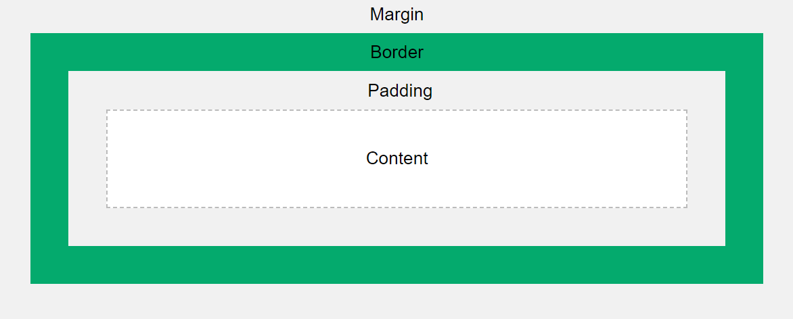

import { IoLogoHtml5 } from "react-icons/io5"
import { DocComponents, ShadcnComponents, FullPageSeparator } from "../../../../components/all"
import Link from "next/link"
import { CodeBlock, Pre } from "fumadocs-ui/components/codeblock"
import { HoverCardInline } from "../../../../components/ui/ease-hovercard"
import { Popup, PopupContent, PopupTrigger } from 'fumadocs-twoslash/ui';
import CodeBlockOutput from "../../../../components/custom/OutputCodeBlock/outputCodeblock"
import { Tab, Tabs } from "fumadocs-ui/components/tabs"
import Image from "next/image"
import W3BoxModelImage from "../../../../app/images/Course1/css/2/w3boxmodel.png"

# The "Box Model"
<>
**Definition:** The CSS box model is a layout concept where every element is considered a rectangular box comprising content, padding, border, and margin.
</>

## Important Styling for Containers
<>
- padding
- margin
- content
- border
</>

## Sizing
<>
- Width (Units too)
- Height (Units too)
- Min/Max w/h
</>

## Example
<>
<CodeBlockOutput>
  <Tabs items={['CSS', 'HTML']} defaultIndex={0}>
    ```css tab="CSS"
    .container {
      width: 300px;
      padding: 20px;
      border: 12px solid blue;
      margin: 5px;
    }
    ```
    ```html tab="HTML"
    <div class="container">
      <p>This is a container styled using the CSS box model.</p>
    </div>
    ```
  </Tabs>
</CodeBlockOutput>

</>

## Properties Overview
<>
| Property  | Description                                              | Example                          |
| --------- | -------------------------------------------------------- | -------------------------------- |
| Padding   | Space between the content and the element's border     | `padding: 20px;{:css}`      |
| Margin    | Space outside the element's border, separating elements  | `margin: 10px;{:css}`       |
| Border    | The line that wraps around the padding and content       | `border: 5px solid #ccc;{:css}`|
| Content   | The actual content of the box                            | Depends on the element           |
| Width     | The width of the element (including units)               | `width: 300px;{:css}`        |
| Height    | The height of the element (including units)              | `height: 200px;{:css}`      |
| Min/Max   | Sets minimum and maximum dimensions for the element      | `min-width: 100px; max-width: 500px;{:css}`|

A really good illustration of these: [From w3schools.com](https://www.w3schools.com/css/css_boxmodel.asp)

</>

## CSS Units

<>
CSS provides different units to define the size of elements. These units can be categorized into **absolute** and **relative** units. 

Absolute units have fixed values, while relative units depend on other elements or the viewport size.
</>

## Absolute Units

<>
<>
Absolute units define a fixed size regardless of the screen or parent elements. These units do not change dynamically when the viewport resizes.

<DocComponents.Callout.Callout>It's recommended to stick to using just `px`, it's a best practice, and considered a standard. Other units exist but are very 'niche'.</DocComponents.Callout.Callout>
| Unit | Description | Example |
|------|------------|---------|
| `px{:css}`  | Pixels – fixed size, does not scale | `width: 100px;{:css}` |
| `cm`  | Centimeters | `width: 10cm;{:css}` |
| `mm`  | Millimeters | `width: 5mm;{:css}` |
| `in`  | Inches (1in = 2.54cm) | `width: 1in;{:css}` |
| `pt`  | Points (1pt = 1/72 of an inch) | `font-size: 12pt;{:css}` |
| `pc`  | Picas (1pc = 12pt) | `font-size: 2pc;{:css}` |
</>
</>

## Relative Units

<>
<>
Relative units adjust dynamically based on their context, making them more flexible for responsive designs.

**There are quite a lot of relative units, I recommend sticking to:**

*For pretty much everything that isn't font*
- % 
- vh (Typically for height)
- vw (Typically for width)

*For fonts (sometimes padding & margins)*:
- em
- rem

| Unit | Description | Example |
|------|------------|---------|
| `%`  | Percentage of the parent element | `width: 50%;{:css}` |
| `em`  | Relative to the parent element's font size | `font-size: 2em;{:css}` (twice the parent size) |
| `rem` | Relative to the root `<html>` element's font size | `font-size: 1.5rem;{:css}` |
| `vw`  | Percentage of the viewport width | `width: 50vw;{:css}` (50% of the viewport width) |
| `vh`  | Percentage of the viewport height | `height: 100vh;{:css}` (full viewport height) |
| `vmin` | Percentage of the smaller viewport dimension | `width: 50vmin;{:css}` |
| `vmax` | Percentage of the larger viewport dimension | `width: 50vmax;{:css}` |
| `ch`  | Relative to the width of the "0" character in the current font | `width: 20ch;{:css}` |
| `ex`  | Relative to the height of the lowercase "x" in the font | `font-size: 2ex;{:css}` |
</>
</>

## Example: Using Different Units


### Relative Units 
<>
<>
Using relative units for styling is typically called Responsive sizing. This is recommended, as it accounts for different screen sizes.

One thing to note is font is harder to scale *responsively*, but when you use 'em' it will scale with the parent, so if the parent uses a responsive sizing like % or vh/vw the font will better scale but will not adjust much.

        **Try resizing this box:**

        <CodeBlockOutput>
            <Tabs items={['CSS', 'HTML']} defaultIndex={0}>
                ```css tab="CSS"
                .container {
                    width: 50vw;
                    height: 50vh;
                    font-size: 1.8em;
                    background-color: gray;
                    padding: 1em;
                    margin: auto
                }
                ```
                ```html tab="HTML"
                <div class="container">
                    This box uses viewport and relative units.
                </div>
                ```
            </Tabs>
        </CodeBlockOutput>
    </>
</>

### Absolute Units 
<>
<>
Using absolute units is generally not advisable unless it's used along side responsive css, which we'll get to later.

Absolute maintains it's size and it will not change with viewport.

        **Try resizing this box:**

        <CodeBlockOutput>
            <Tabs items={['CSS', 'HTML']} defaultIndex={0}>
                ```css tab="CSS"
                .container {
                    width: 350px;
                    height: 250px;
                    font-size: 30px;
                    background-color: gray;
                    padding: 20px;
                    margin: auto
                }
                ```
                ```html tab="HTML"
                <div class="container">
                    This box uses absolute units.
                </div>
                ```
            </Tabs>
        </CodeBlockOutput>
    </>
</>